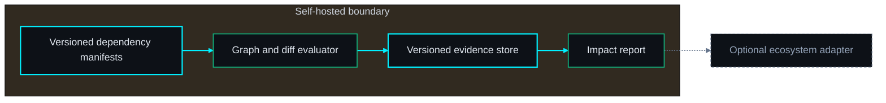
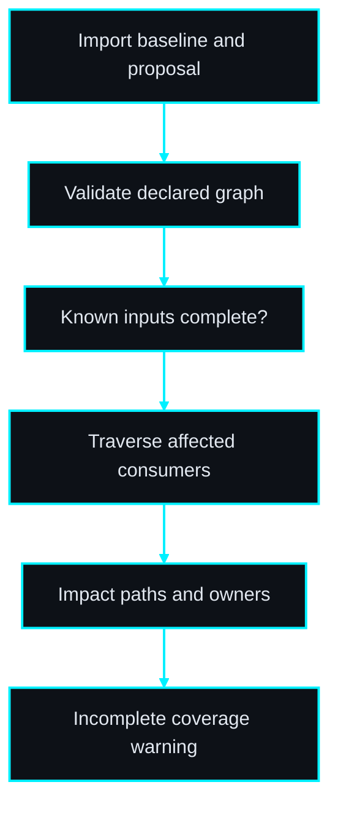
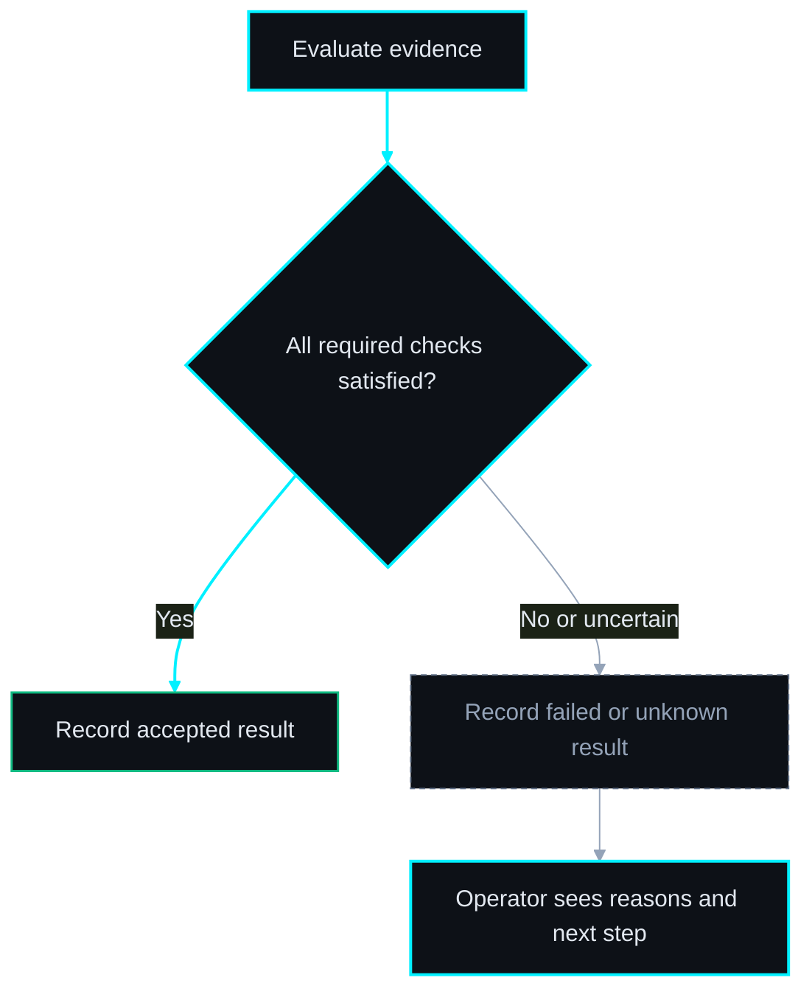

# PRD: ChangeRadar

**See which consumers a proposed change can break.**

Author: Codex via prd-writer · 2026-09-29

Status: Draft; proposed topology; open-source direction; implementation not started. Board: #3793 (authoring only).

## 1. Problem Statement

An API field, secret alias or artifact path changes in one service while downstream jobs silently continue with invalid assumptions. Dependency knowledge lives in people and scattered configuration.

**Primary user / buyer:** Operators maintaining several services and automation workflows.

**Evidence status:** product hypothesis from ecosystem operational pain, not validated demand. No competitor absence or willingness-to-pay claim is made. Before building beyond a synthetic prototype, interview three prospective users, capture five recent examples and compare the proposed workflow with their current tools.

## 2. Goal

Build an explainable dependency graph from explicit versioned manifests and assess a proposed manifest diff against known consumers before rollout.

**Position in the ecosystem:** Mission Control displays service health. ChangeRadar answers pre-change impact questions. It does not infer that an unlisted dependency does not exist.

**Open-source boundary:** the complete deterministic MVP, schemas, synthetic examples, test harness and operational documentation belong in the public source release. Self-hosting must not require a license server or private fleet service. Hosted operation/support is a possible later business model; willingness to pay must be tested. License and product-name clearance remain owner decisions before publication.

## 3. Non-Goals

General observability; production traffic interception; automatic code changes; universal code analysis; claiming complete discovery from partial inputs.

No sibling product is a mandatory runtime dependency. No repository creation, implementation dispatch, production mutation, merge or deployment is authorized by this PRD authoring task. AI-generated prose cannot substitute for test evidence or operator approval.

## 4. Success Metrics

| Metric | Baseline collection | Pilot target | Evidence |
| --- | --- | --- | --- |
| Baseline completion | Before first pilot: time five current manual workflows and record errors | Five usable baseline records per pilot team | Dated operator worksheet |
| Time to identify all known affected owners in a seeded change drill | Use the same scenario class and record sample size | At least 50% reduction, with 100% of seeded breaking edges surfaced | Raw timestamps and outcome receipts |
| Activation | Record starting user count in the pilot | Three teams complete a synthetic core workflow within 30 minutes of install | Opt-in operator reports |
| Retention / value | Ask whether current workflow is still used after four weeks | Two of three teams elect to continue using the tool | Interview with concrete saved-time examples |

Targets are proposed decision thresholds. Report failures and sample sizes; small pilots do not establish market demand. Stop expansion if the baseline shows no recurring pain or existing tools solve it sufficiently.

## 5. Acceptance Criteria

- [ ] **AC-01** — Import schema-versioned manifests with unique node IDs and source provenance; reject dangling edges and unsupported major schemas atomically.
- [ ] **AC-02** — Removing a required field identifies direct and transitive consumers with an ordered source-to-consumer path and owner.
- [ ] **AC-03** — Cycles terminate deterministically; repeated imports of identical content produce the same graph hash and sorted findings.
- [ ] **AC-04** — Unknown or stale consumer contracts produce INCOMPLETE, never a safe verdict; an isolated change says NO_KNOWN_IMPACT with coverage limits.
- [ ] **AC-05** — Assess against an immutable baseline hash; a concurrent changed baseline rejects stale requests with 409.
- [ ] **AC-06** — Read-only contract checks time out within configured limits; failures are visible and never converted to passed checks.
- [ ] **AC-07** — Graph views support empty, loading, denied and failed states; exported JSON and HTML contain the same finding IDs.
- [ ] **AC-08** — A synthetic demo works without paid accounts or mandatory telemetry; an outbound-denied test completes the deterministic local core. Live connector operations fail explicitly when disconnected.
- [ ] **AC-09** — Validate size and schema before processing; planted secret tokens never appear in logs or exported reports; malicious HTML renders as text.
- [ ] **AC-10** — Export a versioned evidence bundle and restore/read it in a clean installation with matching hashes; truncated or unsupported exports fail without partial accepted state.
- [ ] **AC-11** — Release documentation includes installation, upgrade, backup, restore and failure diagnosis; a fresh operator can execute the synthetic smoke procedure.
- [ ] **AC-12** — Enforce workspace membership and admin/operator/viewer roles on reads, writes, jobs and exports; cross-workspace object IDs return 404 with no state change.
- [ ] **AC-13** — Worker restart reclaims leased jobs without discarding uncertain external outcomes; failed migrations stop readiness and a restored backup preserves references.

## 5b. Test Strategy

**SEC · 04c — Test Strategy & DoD**

**13 mapped ACs / 13 total ACs. All tests are PLANNED; none is claimed to pass.**

| AC | Level | Proven by — planned behavior | Execution | Status |
| --- | --- | --- | --- | --- |
| AC-01 | Unit + integration / E2E | `tests/changeradar.spec.ts :: <manifest validation>` — assert the criterion, including its failure boundary. | Automated; live sandbox gated | PLANNED |
| AC-02 | Unit + integration / E2E | `tests/changeradar.spec.ts :: <breaking contract propagation>` — assert the criterion, including its failure boundary. | Automated; live sandbox gated | PLANNED |
| AC-03 | Unit + integration / E2E | `tests/changeradar.spec.ts :: <cycles and determinism>` — assert the criterion, including its failure boundary. | Automated; live sandbox gated | PLANNED |
| AC-04 | Unit + integration / E2E | `tests/changeradar.spec.ts :: <unknown coverage>` — assert the criterion, including its failure boundary. | Automated; live sandbox gated | PLANNED |
| AC-05 | Unit + integration / E2E | `tests/changeradar.spec.ts :: <baseline race>` — assert the criterion, including its failure boundary. | Automated; live sandbox gated | PLANNED |
| AC-06 | Unit + integration / E2E | `tests/changeradar.spec.ts :: <contract timeout>` — assert the criterion, including its failure boundary. | Automated; live sandbox gated | PLANNED |
| AC-07 | Unit + integration / E2E | `tests/changeradar.spec.ts :: <report equivalence>` — assert the criterion, including its failure boundary. | Automated; live sandbox gated | PLANNED |
| AC-08 | Unit + integration / E2E | `tests/changeradar.spec.ts :: <offline demo>` — assert the criterion, including its failure boundary. | Automated; live sandbox gated | PLANNED |
| AC-09 | Unit + integration / E2E | `tests/changeradar.spec.ts :: <redaction and hostile input>` — assert the criterion, including its failure boundary. | Automated; live sandbox gated | PLANNED |
| AC-10 | Unit + integration / E2E | `tests/changeradar.spec.ts :: <portability and corruption>` — assert the criterion, including its failure boundary. | Automated; live sandbox gated | PLANNED |
| AC-11 | Human + E2E | Non-builder follows supplied runbook in a fresh sandbox; record all assistance, step outcomes and cleanup receipt (§9 independent drill). | Human receipt + harness | PLANNED |
| AC-12 | Unit + integration / E2E | `tests/changeradar.spec.ts :: <workspace isolation>` — assert the criterion, including its failure boundary. | Automated; live sandbox gated | PLANNED |
| AC-13 | Unit + integration / E2E | `tests/changeradar.spec.ts :: <restart and restore>` — assert the criterion, including its failure boundary. | Automated; live sandbox gated | PLANNED |

### Flow and failure coverage

| User-facing flow | Happy path | Sad path / boundary |
| --- | --- | --- |
| manifest validation | Import schema-versioned manifests with unique node IDs and source provenance; reject dangling edges and unsupported major schemas atomically. | Inject the rejected/uncertain condition in this criterion; assert no accepted result or unauthorized state change. |
| breaking contract propagation | Removing a required field identifies direct and transitive consumers with an ordered source-to-consumer path and owner. | Inject the rejected/uncertain condition in this criterion; assert no accepted result or unauthorized state change. |
| cycles and determinism | Cycles terminate deterministically; repeated imports of identical content produce the same graph hash and sorted findings. | Inject the rejected/uncertain condition in this criterion; assert no accepted result or unauthorized state change. |
| unknown coverage | Unknown or stale consumer contracts produce INCOMPLETE, never a safe verdict; an isolated change says NO_KNOWN_IMPACT with coverage limits. | Inject the rejected/uncertain condition in this criterion; assert no accepted result or unauthorized state change. |
| baseline race | Assess against an immutable baseline hash; a concurrent changed baseline rejects stale requests with 409. | Inject the rejected/uncertain condition in this criterion; assert no accepted result or unauthorized state change. |
| contract timeout | Read-only contract checks time out within configured limits; failures are visible and never converted to passed checks. | Inject the rejected/uncertain condition in this criterion; assert no accepted result or unauthorized state change. |
| report equivalence | Graph views support empty, loading, denied and failed states; exported JSON and HTML contain the same finding IDs. | Inject the rejected/uncertain condition in this criterion; assert no accepted result or unauthorized state change. |

### Fixtures and runners
Use deterministic UTC clocks, synthetic IDs and planted fake secrets. Default tests cannot access customer accounts. Unit tests cover decision rules and state boundaries. Integration tests exercise real persistence and adapters against controlled fixtures; browser tests exercise API-backed UI rather than route mocks. For a CLI, E2E invokes the packaged executable in a fresh temporary directory and checks exit codes plus report contents. Add a static-report browser smoke for escaping, readable tables and empty/error states.

Each service module requires meaningful normal, invalid and boundary cases; each API router requires success, authorization and conflict tests. Each implemented page receives an E2E smoke and render tests for loading, empty and failure. Target at least 90% branch/line coverage of new decision and service code, with exclusions documented. Coverage is supporting evidence, not a substitute for the matrix.

Live adapters need opt-in sandbox tests pinned to provider/version and sanitized evidence. If credentials or a supported provider are absent, mark BLOCKED; mock success does not satisfy a live criterion. A seeded mandatory failure must turn the release verdict red. QA reconciles planned behavior labels to real test IDs in the implementation PR.

The final receipt records every repository SHA, dirty-tree status, environment, command, exit code, run time, fixture version, artifact hashes, skipped tests and unresolved findings. Any required NOT RUN, PARTIAL or BLOCKED row prevents a claim that the matrix passed.


## 5c. Definition of Done

Reference the canonical **CLAUDE.md → Quality Gate Standard (ALL repos)** at implementation time; resolve its actual workspace path in the build handoff and follow the current local/swarm runner policy. Do not introduce a competing universal gate in this PRD.

Feature-specific release conditions: every numbered acceptance criterion has current evidence; live criteria have live sandbox receipts; independent review of the final tested revision has zero P0/P1; seeded negative controls fail as intended; documentation explains unknown/partial states. Manual manifests can become stale; adoption depends on a low-maintenance ownership and update workflow. Static analysis alone cannot establish actual runtime completeness.

This document is a requirements draft, not an implementation or release receipt.

## 6. Technical Spec

### Proposed architecture

TypeScript API and worker, PostgreSQL, React graph/report view. Explicit manifests are authoritative inputs; no fleet crawling. Limit MVP to 10,000 nodes and 50,000 edges per snapshot.

#### ◇ Diagram — Architecture
*The core works independently; adapters are optional.*



> **THE POINT:** The core works independently; adapters are optional.

#### ◇ Diagram — Workflow
*Persist evidence at each boundary; unresolved outcomes remain visible.*



> **THE POINT:** Persist evidence at each boundary; unresolved outcomes remain visible.

#### ◇ Diagram — Acceptance decision
*Completion and acceptance are separate; uncertainty cannot become success.*



> **THE POINT:** Completion and acceptance are separate; uncertainty cannot become success.


### Data model

snapshots(id UUID, workspace_id UUID, manifest_hash TEXT, revision TEXT, imported_at UTC); nodes(id TEXT, kind ENUM[service,job,contract,credential_alias,artifact], owner TEXT, version TEXT); edges(source_id TEXT, target_id TEXT, relation ENUM[consumes,requires,produces], source_file TEXT, source_line INT, verified_at UTC); impact_runs(id UUID, snapshot_id UUID, proposed_hash TEXT, status ENUM, unknowns JSON); findings(id UUID, run_id UUID, consumer_id TEXT, path JSON, severity ENUM, reason TEXT)

Use schema_version on serialized documents, UUID primary IDs, UTC timestamps and content hashes over a documented canonical JSON encoding. Scope child references to their parent/workspace and enforce foreign keys. Index parent IDs, state and due timestamps. Append attempts and evidence; do not overwrite history to hide failures. Retain redacted evidence 90 days by default, configurable by operator; primary deletion completes within 24 hours and rotated backups expire within 30 days. The production operator must approve these defaults before customer data ingestion.

### Interface contract

`POST /api/v1/snapshots {schema_version:1,revision,manifest}` -> 201 `{id,hash,warnings}`. `POST /api/v1/impact-runs {snapshot_id,proposed_manifest,expected_hash}` -> 202 `{id,status:"queued"}`. `GET /api/v1/impact-runs/{id}` -> 200 `{status,affected,paths,unknowns}`. Stale expected_hash -> 409; invalid graph -> 422; unauthorized IDs -> 404.

HTTP routes use the `/api/v1` prefix throughout, including abbreviated routes above. Errors are `{error:{code,message,request_id}}`: 400 malformed input, 401 unauthenticated, 403 forbidden action, 404 inaccessible object, 409 version/idempotency conflict, 413 oversize payload, 422 schema/policy rejection, 429 rate limit, 503 dependency unavailable. Lists cap at 100 entries with cursor pagination. Request and response schemas ship in the repository.

For daemon products, local admin bootstrap uses a CLI and no default password. Sessions are revocable HttpOnly cookies with CSRF protection; authorization applies to every query, worker job and download. Admin manages policies/connectors, operator performs scoped workflows, viewer reads redacted reports. Secrets are encrypted using an operator-managed key outside the database. CLI products trust the local OS user; they expose no listening port or multi-user authorization promise. Evidence directories default to owner-only permissions.

Mutation Idempotency-Key scope is workspace + actor + route; same key/body returns the same receipt, changed body returns 409. Retain keys at least seven days. Version-sensitive operations require expected_version or plan_hash. Database leases use bounded claims and transactional outbox events. Read-only checks can retry three times with exponential backoff; remote write ambiguity follows the stricter product state machine and never uses blind retry.

### State and uncertainty contract

Snapshots are immutable. Runs transition QUEUED → RUNNING → COMPLETE or FAILED. COMPLETE describes computation, not safety. Overall assessment is AFFECTED, NO_KNOWN_IMPACT or INCOMPLETE. Missing owners, stale contracts and unknown nodes force INCOMPLETE; graph cycles are supported and reported, not recursively traversed forever.

### Ecosystem adapter boundary

Optional manifests exported by the three services; Mission Control links impact reports. Store credential aliases only, never secret values.

Adapters use a versioned envelope `{schema_version:1,event_id,source,resource_id,event_type,occurred_at,revision,evidence_ref}` with optional correlation_id. Deduplicate event_id at consumers, reject unsupported major versions and preserve ordering/version metadata. Delivery is at least once; consumers do not infer current state from an old event. Connections are optional and disabled by default. Export bundles work without network connectivity.

### Security and resource limits
Do not execute commands from imported receipts, arbitrary URLs or model text. Validate paths, symlinks, archive expansion limits and allowed content types; report text is HTML-escaped. Outbound endpoints are configured by administrators and checked against an allowlist including redirects and DNS resolution. No private addresses, secrets or real customer identifiers appear in public examples. Use `localhost` in user-facing demo instructions; document binding semantics explicitly. Logs redact credentials, personal fields and authorization headers. HandoffCheck's explicitly supplied execution scripts are the sole execution exception and run only within its isolated VM contract.

Default import limit is 25 MB metadata and 1,000 files; blob bundle cap 250 MB with explicit override. Fail before work when capacity is insufficient. Benchmark the deterministic core on 2 CPU/4 GB: 1,000 records should finish within 30 seconds excluding provider I/O and VM setup; record this as a performance experiment before fixing an external SLA. Expose queued, running, failed and unknown status with actionable reasons.

### Deployment, rollback and dependencies
Pin supported runtime/package versions during implementation and verify adapter behavior against primary provider documentation. No provider support is implied by this draft. CLI tools distribute a versioned package plus checksums; daemon products provide Compose, database migrations and example configuration with placeholders. Runtime telemetry is off by default.

Before an upgrade, stop side-effect workers, back up metadata and encrypted evidence, and test restoration in an isolated environment. Prefer expand/contract migrations; rollback uses a verified snapshot where schema downgrade is unsafe. Reconcile external outcomes before enabling writes after restore. A restored local database cannot undo remote effects. Stage rollout: synthetic local prototype → read-only sandbox → scoped approved live sandbox → independent acceptance → owner-selected public release.


## 7. Agent Team Plan

| Owner | Exclusive files | Deliverable |
| --- | --- | --- |
| Core / backend | src/api/impact.ts; src/services/graph.ts; src/services/diff.ts; src/workers/checks.ts; schemas/dependencies.json; migrations/001_initial.sql for daemon products | Schemas, state machine, interfaces and adapter contracts |
| UI / report | src/web/App.tsx; src/web/Report.tsx; src/web/styles.css; templates/report.html | Daemon screens or static CLI report as appropriate; no backend edits |
| QA / packaging | tests/changeradar.spec.ts; tests/e2e/smoke.spec.ts; fixtures/demo.json; scripts/verify-quality.sh; README.md; Dockerfile | Evidence matrix, negative controls, packaging and operator runbook |


Future dispatch only. No implementation agents are started by PRD authoring. Backend freezes schemas first; UI consumes them and proposes changes through the backend owner. QA reports implementation defects to the owning agent instead of editing overlapping files. Coordinator resolves shared configuration and reviews final integration.

Milestones: (1) validate pain and unresolved provider capability; (2) schemas and deterministic core with failure states; (3) synthetic end-to-end demonstration; (4) selected connector sandbox and fault injection where applicable; (5) independent review/QA on exact revisions; (6) operator-approved public release. Stop at a provider capability blocker rather than weakening safety criteria.


## 8. Open Questions

- **HIGH — Provider / runner:** Select the first manifest sources and contract formats; proposed MVP uses explicit JSON manifests and a limited required-field/type subset, not arbitrary schema compatibility.
- **HIGH — Publication:** choose license, verify working name availability, maintainer and release support commitment. No license is selected by this draft.
- **HIGH — Data policy:** approve retention and connector scope before using real records.
- **STRATEGIC — Demand:** verify recurring pain and the decision to pay for hosted operation; stars and downloads do not establish value.

**Risk:** Manual manifests can become stale; adoption depends on a low-maintenance ownership and update workflow. Static analysis alone cannot establish actual runtime completeness.

Architecture choices are proposed defaults for autonomous drafting; no topology approval or implementation authorization is inferred.

## 9. Operator Action Checklist

**SEC · 01b — Operator prerequisites**

| Action | Exact task | Unblocks | Where | Cost |
| --- | --- | --- | --- | --- |
| Validate problem | Interview three target operators and record five recent failure examples before expanding MVP. | Pilot evidence | [ChangeRadar open questions](changeradar.md#8-open-questions) | No vendor cost; operator time |
| Select connector/runner | Select the first manifest sources and contract formats; proposed MVP uses explicit JSON manifests and a limited required-field/type subset, not arbitrary schema compatibility. | Live pilot readiness | [ChangeRadar open questions](changeradar.md#8-open-questions) | Provider/VM cost unpriced; no spending authorized |
| Run independent drill | Have a non-builder run the documented synthetic smoke; record identity, timing and help received. | Acceptance evidence | [ChangeRadar open questions](changeradar.md#8-open-questions) | Operator time |
| Prepare public release | Choose license, maintainer, repository name, security contact and supported-version policy. | Publication | [ChangeRadar open questions](changeradar.md#8-open-questions) | Hosting optional; budget decision pending |
| Set retention and access | Approve data retention, backup recovery and who may administer integrations. | Real data processing | [ChangeRadar open questions](changeradar.md#8-open-questions) | Operator time |

Checks in the HTML persist locally and are operator notes, not evidence that external work was completed.

## Build handoff

After resolving build-blocking questions and selecting this product:

```text
/feature-team docs/prd/changeradar.md
```
