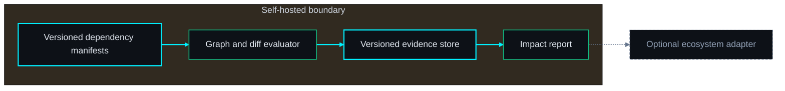
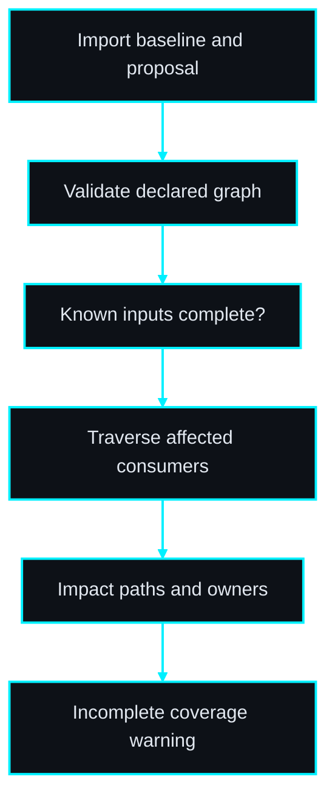
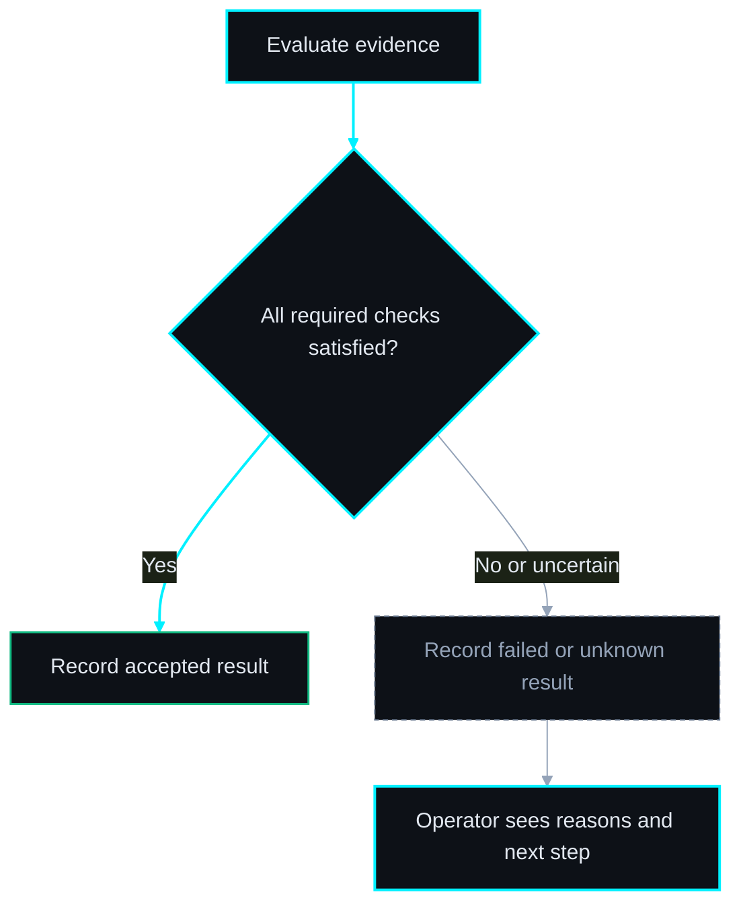

# ChangeRadar diagram pack

Status: proposed topology for autonomous PRD drafting; not approved for implementation.

#### ◇ Diagram — Architecture
*The core works independently; adapters are optional.*

> **THE POINT:** The core works independently; adapters are optional.

#### ◇ Diagram — Workflow
*Persist evidence at each boundary; unresolved outcomes remain visible.*

> **THE POINT:** Persist evidence at each boundary; unresolved outcomes remain visible.

#### ◇ Diagram — Acceptance decision
*Completion and acceptance are separate; uncertainty cannot become success.*

> **THE POINT:** Completion and acceptance are separate; uncertainty cannot become success.

## Proposed decisions

Select the first manifest sources and contract formats; proposed MVP uses explicit JSON manifests and a limited required-field/type subset, not arbitrary schema compatibility.

## Risk flags

Manual manifests can become stale; adoption depends on a low-maintenance ownership and update workflow. Static analysis alone cannot establish actual runtime completeness.
